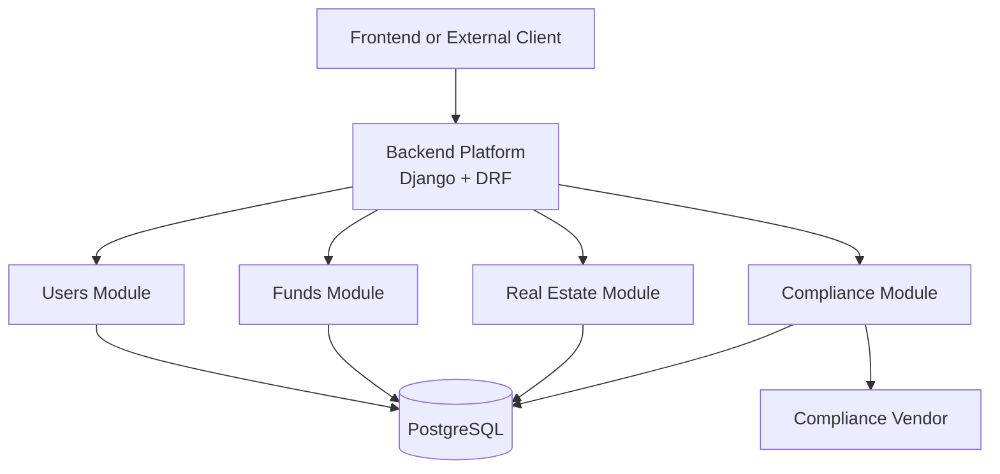
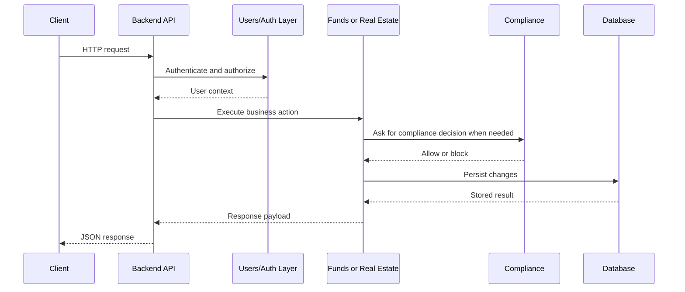
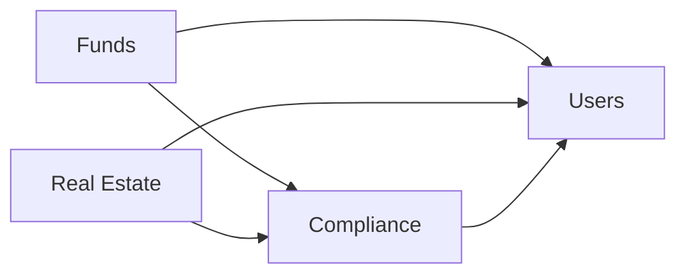

# Finance Remade Backend

The backend is a Django and Django REST Framework application that exposes the platform’s operational APIs for:

- identity and access control
- private fund management
- real estate portfolio operations
- KYC, KYB, and AML compliance workflows

It is designed as one backend platform with multiple domain modules behind a unified `/api/` surface.

## Architecture Overview



## Module Map

### `backend_app`

The project shell. It is responsible for:

- global settings
- URL routing
- middleware
- REST framework configuration
- deployment and security defaults

### `users`

Identity and access control. It handles:

- user accounts
- login and token refresh
- DPoP-bound JWT authentication
- role assignment
- audit logs

### `funds`

Private fund operations. It handles:

- funds
- model inputs
- investment deals
- investor actions
- distributions
- reporting

### `real_estate`

Real estate operations. It handles:

- portfolios
- properties
- financing and installments
- off-plan workflows
- sales and disposals
- bookkeeping ledger flows
- reports
- real-estate investor actions

### `compliance`

KYC, KYB, and AML control layer. It handles:

- compliance profiles and cases
- screenings
- evidence and risk records
- reviewer tasks and decisions
- restrictions
- vendor orchestration
- operability checks used by `funds` and `real_estate`

## Request Flow



## Current API Surface

The backend is organized by domain namespace:

- `/api/users/`
- `/api/compliance/`
- `/api/funds/`
- `/api/real-estate/`

There is also:

- `/admin/` for Django admin
- `/api/ping/` for health/ping behavior

## Security Model

The backend currently uses:

- DPoP-bound JWT authentication
- role-based access control
- throttling on public auth flows
- audit logging for security and administrative actions
- compliance gating for investor-operability decisions

This means sensitive actions are enforced on the backend, not only in the UI.

## Interaction Between Modules



### Practical meaning

- `funds` and `real_estate` rely on `users` for authenticated identity and permission checks
- `funds` and `real_estate` rely on `compliance` for investor operability and money-movement style gating
- `compliance` uses platform user identities for applicants, reviewers, and administrators, but owns its own regulatory records

## Typical Backend Capabilities

### User and access management

- user application and approval
- login and refresh
- role assignment and removal
- audit log review

### Fund operations

- fund CRUD
- model input updates
- deal and investment round management
- investor dashboards and actions
- distributions and reporting

### Real estate operations

- portfolio and property management
- financing and installment scheduling
- off-plan and sale workflows
- investor logs and actions
- ledger and reporting flows

### Compliance operations

- applicant case visibility
- entity and relationship onboarding
- reviewer tasking and decisions
- restrictions and risk assessment
- vendor sync and webhook intake

## Third-Party Integration Guidance

The safest integration approach is to integrate by API domain rather than by direct database access.

Recommended patterns:

- use `/api/users/` for identity-linked workflows
- use `/api/funds/` for fund operations and reporting workflows
- use `/api/real-estate/` for portfolio operations
- use `/api/compliance/` for KYC/KYB/AML workflows and vendor-connected processes

Avoid:

- writing directly to database tables
- bypassing permission or compliance checks
- coupling to internal model structure instead of API contracts

## Project Layout

```text
backend/
  backend_app/     Project shell and shared configuration
  users/           Identity, auth, roles, audit
  funds/           Fund operations and reporting
  real_estate/     Real estate operations and reporting
  compliance/      KYC/KYB/AML domain
```

## Common Commands

```bash
python manage.py migrate
python manage.py runserver
python manage.py createsuperuser
python manage.py test
```

## Related Documentation

For a fuller explanation of system design, see:

- [Application Architecture Index](../docs/application-architecture/README.md)
- [System Overview](../docs/application-architecture/system-overview.md)
- [Backend Platform](../docs/application-architecture/backend-platform.md)
- [Users Module](../docs/application-architecture/users-module.md)
- [Funds Module](../docs/application-architecture/funds-module.md)
- [Real Estate Module](../docs/application-architecture/real-estate-module.md)
- [Compliance Module](../docs/application-architecture/compliance-module.md)
