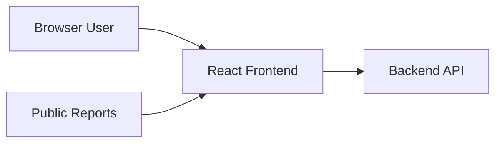
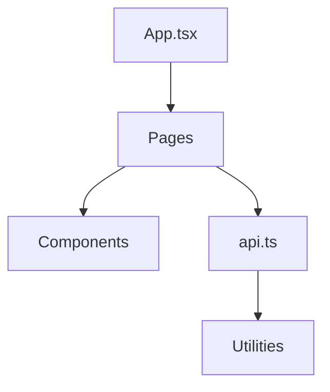
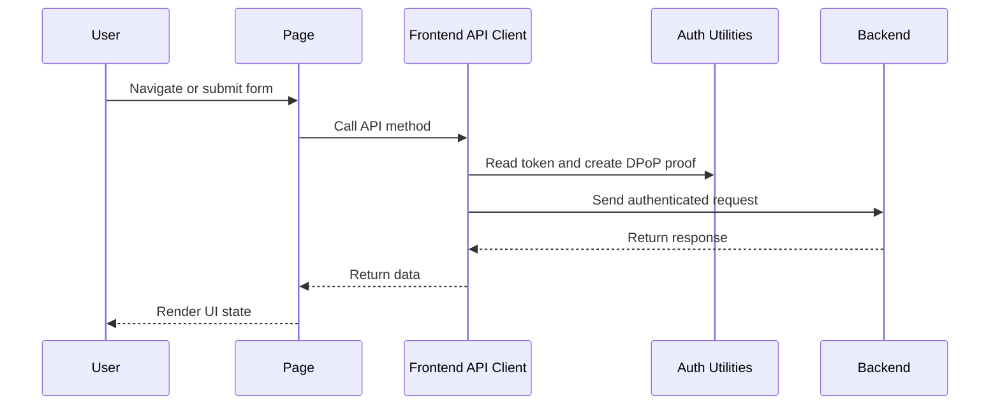
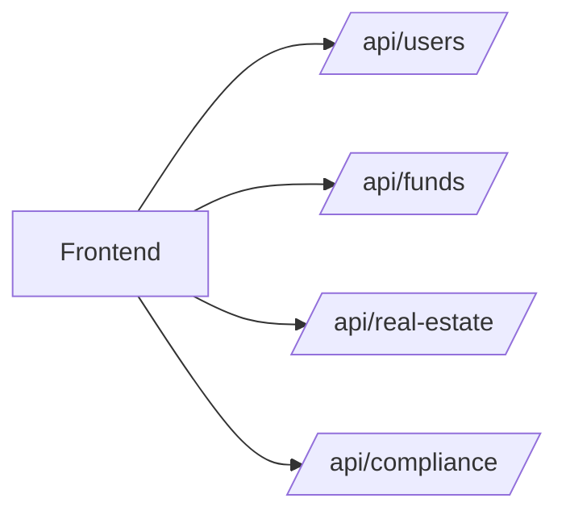

# Finance Remade Frontend

The frontend is a React and TypeScript single-page application that serves as the user operating layer for the platform.

It supports:

- login and access application
- general user and admin dashboards
- private fund workflows
- real estate portfolio workflows
- investor views
- applicant and reviewer compliance workflows

## Frontend Overview



## Main Responsibilities

The frontend is responsible for:

- presenting workflows and dashboards
- collecting user input
- calling backend APIs
- rendering analytics, tables, and reports
- handling route protection and session behavior

The frontend is not the source of truth for:

- permissions
- compliance approval
- investor operability
- authoritative financial business logic

Those decisions are enforced by the backend.

## Application Structure



## Main Frontend Areas

### Access and identity

- login page
- registration / access application page
- private route handling
- admin route handling

### General user experience

- dashboard
- profile page
- investor dashboard

### Fund workflows

- fund dashboard
- deal and model input management
- investor logs and investor requests
- distributions and reports

### Real estate workflows

- real estate dashboard
- portfolio dashboard
- property, financing, installment, off-plan, sales, and bookkeeping views
- public report pages

### Compliance workflows

- applicant compliance portal
- staff/admin compliance review console

## Request and Session Flow



## Security and Session Handling

The frontend currently includes:

- centralized API clients for authenticated and public calls
- DPoP proof generation
- session token storage in browser session storage
- proactive token refresh behavior
- route guards for authenticated and admin-only screens

## Visual and Interaction Model

The UI is organized as workflow pages backed by reusable components. In practice that means:

- pages orchestrate data loading and navigation
- components render focused domain sections such as tabs, charts, logs, and forms
- utilities provide shared auth, finance, formatting, and DPoP helpers

## Domain Interaction Map



## Typical User Journeys

### Standard user

- logs in
- views dashboard and profile
- accesses assigned fund or real estate areas
- sees only routes allowed by role and backend responses

### Investor or applicant

- views investment-related dashboard information
- submits investor requests where enabled
- interacts with compliance case information if onboarding is required

### Admin or reviewer

- manages users and roles
- accesses compliance review workflows
- supervises fund and real estate operational areas

## Third-Party Integration Relevance

The frontend is useful to third parties mainly as a workflow surface rather than a system-of-record boundary.

Common extension patterns:

- embedded widgets for verification or document collection
- partner-branded workflow experiences
- analytics or monitoring overlays
- custom portals built on the same backend API

The recommended pattern is still:

1. integrate at the backend API
2. expose the result in the frontend

## Project Layout

```text
frontend/frontend-app/src/
  api/          API client layer
  components/   Reusable UI building blocks
  pages/        Route-level workflow pages
  utils/        Shared helpers
```

## Commands

```bash
npm run dev
npm run build
npm run lint
```

## Related Documentation

For a broader architecture explanation, see:

- [Application Architecture Index](../../docs/application-architecture/README.md)
- [System Overview](../../docs/application-architecture/system-overview.md)
- [Frontend Web App](../../docs/application-architecture/frontend-web-app.md)
- [Backend Platform](../../docs/application-architecture/backend-platform.md)
